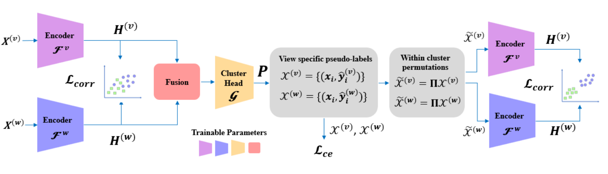

# COPER: Correlation-based Permutations for Multi-View Clustering (ICLR 2025)

Official implementation of the accepted paper.

<p align="center">

</p>


We propose an end-to-end deep learning-based multi-view clustering framework for general data types (such as images and tables). 
Our approach involves generating meaningful fused representations using a novel permutation-based canonical correlation objective. 
Cluster assignments are learned by identifying consistent pseudo-labels across multiple views.

### How to run:

0. Download the datasets here: [multiview datasets](https://biu365-my.sharepoint.com/:f:/g/personal/svirskj_biu_ac_il/Es78WjrYx2NJqdFbYR1giz4BHHk-UaCmzphyLolkTVYZdQ?e=l46YTf)
   - please see the datasets details in [DATASETS.md](https://github.com/LindenbaumLab/COPER/blob/main/DATASETS.md)
2. Update the path to the dataset in config files `conf/<dataset_name>.yaml`
2. Run training: `python coper.py --cfg <config file>`
3. Please note that for improved stability the model is trained with decoders by default.


### Authors:

* Jonathan Svirsky
* Ran Eisenberg
* Ofir Lindenbaum


### Citing:

If you are using this code or datasets, please cite our paper:

```
@inproceedings{
eisenberg2025coper,
title={{COPER}: Correlation-based Permutations for Multi-View Clustering},
author={Ran Eisenberg and Jonathan Svirsky and Ofir Lindenbaum},
booktitle={The Thirteenth International Conference on Learning Representations},
year={2025},
url={https://openreview.net/forum?id=5ZEbpBYGwH}
}
```